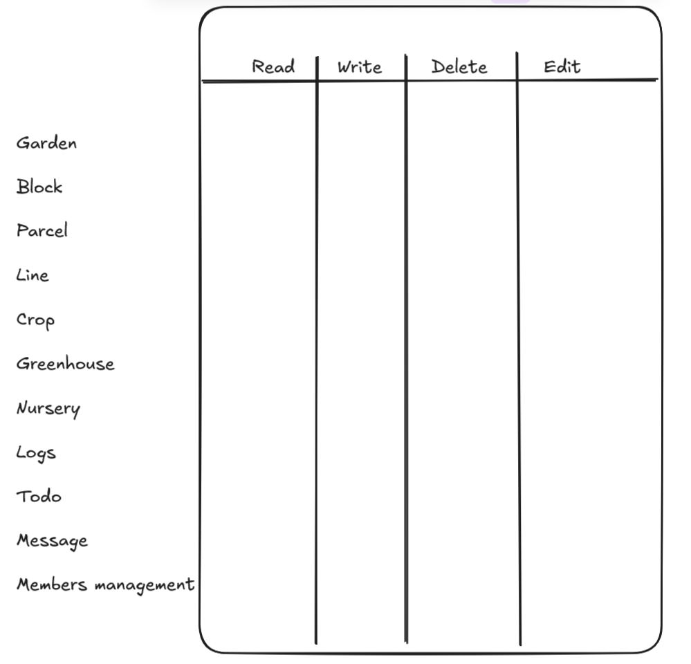

# Road Map

## Add harvest possibilities!!!

## Notification
- Add a bell in all page (slider menu)
- See all change in your garden + message + invitation 

## Implement Greenhouse and Blocks in Garden
- Greenhouse in a new Graden object with some parcels insdide. We must define length, width, height and name
- Block is just a way to organise parcels. It's more a kind of container than an object.

## Garden Editor
- Edit same info as in creation
- Manage permission
- Manage contributors

## Profile Editors
- Edit same info as in creation
- Manage friends
- Manage follows

## Manage Garden Colaborators

- Send request
- Send invitation
- Manage colaborator role in garden
- *All colaborator have read access in the garden*
    - Admin
    - Consultant (Only todo access)
    - Gardeners
    - Custom role

    

## Friend system
- Send invitation
- Manage invitation

## Feed
- Create Like comment publication
- Automatic publication with important logs

## Follower system
- Link front and back ( Backend route is ready )

## Todo System
- For each garden item (garden, parcel, bed, line, crop, greenhouse, nursery, block) add button to add Todo
- In slider menu add todo button to display all your todo with filter option (new page)
- Change the status of todo

## Add message systeme
- Private messagery
- Garden Messagery

## Add badge system
- Add badge when perform a specific action (create garden, follow someone, join garden, etc...)

## Crop copy system
- Add possibilities of copy crop of someone. When a crop is copied, you have an automatic generation of all the todo's you have to perform to achieve this crop.

## Graphic Mode

